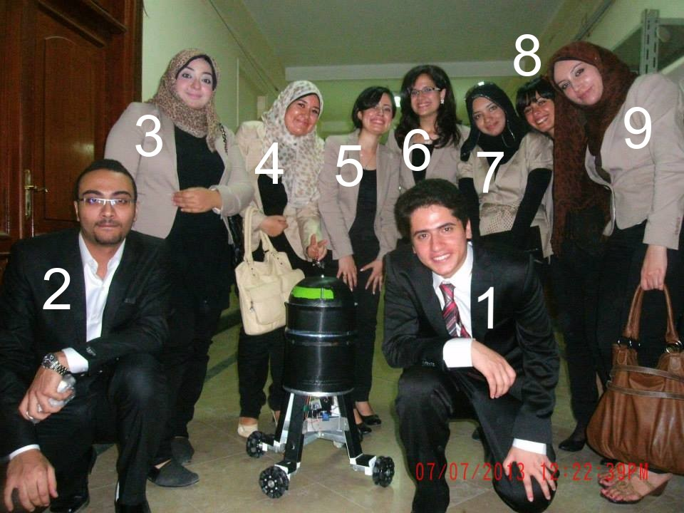

# Description
- This is my graduation project.
- We were trying to make a prototype for service robotics.
    - The Robot would navigate the appartment, do obstacle avoidance and Learn objects shapes.
- This is the mind of a Robot that uses kinect depth images to avoid obstacles and explore places.
- It uses Kinect RGB images to learn object shapes using the SURF Keypoints and do min Ecludian distance with the learned objects.
- It uses Kinect depth images to segment objects.
- It uses Arduino to control the robot motion, It sends a control signals to the robot motor every few milliseconds (10 ms).

# Team Members
We were a Team of 9 Computer Engineering Seniors:
1. Remon Kamal (me)
2. Ahmed El-Naggar
3. Mai El-Naggar
4. Maha Atef
5. Maryan Gebrial
6. Silvia Soliman
7. Lamess Said
8. Marina Said
9. Nehal Kamal

# Requirements:
## Hardware Requirements
- Kinect Camera.
- Arduino.
- A robot with motors and Wheels that you can send to it the control signal.

## Software Requirements
- CMake 2.8.11 or higher
- OpenNI
- OpenMP
- OpenCV
- MRPT (Mobile Robotics toolkit)
- Qt5Core
- Qt5Concurrent
- C++ Compiler